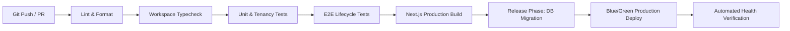

# KinderManagement Release Readiness & Disaster Recovery Runbook

> **Version**: 1.0.0  
> **Target Audience**: DevOps Engineers, SREs, Tech Leads, On-call Engineers  
> **Scope**: Multi-Tenant Kindergarten Management Platform (`apps/web`, `packages/*`, Supabase PostgreSQL)

---

## 1. CI/CD Deployment Pipeline

The production deployment flow guarantees that code reaching production satisfies all strict quality gates, tenancy boundaries, and zero TypeScript regressions.



### 1.1 Quality Gates Checklist

| Stage | Command | Threshold / SLA |
| :--- | :--- | :--- |
| **Linting** | `pnpm lint` | 0 warnings, 0 errors |
| **Typecheck** | `pnpm typecheck` | 0 errors across all 5 workspace packages |
| **Tenancy & Unit Tests** | `pnpm test` | 100% passing; zero residual test data |
| **E2E Golden Paths** | `pnpm --filter @km/web exec playwright test` | 100% passing across critical journeys |
| **Production Build** | `pnpm --filter @km/web build` | Exit code 0; bundle budgets within thresholds |

---

## 2. Zero-Downtime Database Migration Strategy

KinderManagement uses Prisma ORM on Supabase PostgreSQL. Because the platform operates 24/7 for school staff and parents, database migrations must adhere strictly to the **Expand and Contract** pattern.

### 2.1 The "Expand and Contract" Rule

1. **Phase 1: Expand (Additive Changes)**
   - Only add new tables, nullable columns, or columns with default values.
   - Never rename or drop columns currently queried by the active running application version.
2. **Phase 2: Transition (Dual Writes / Reads)**
   - Deploy application version $N+1$ that reads and writes both old and new schema structures.
   - Run background backfill script if required.
3. **Phase 3: Contract (Cleanup)**
   - Once application version $N+1$ is fully stable and version $N$ is completely decommissioned, deploy a subsequent migration to remove obsolete columns/tables.

### 2.2 Migration Execution Protocol

Migrations are applied automatically during the CI/CD **Release Phase** before the new container / edge server begins receiving traffic:

```bash
# 1. Inspect pending migrations
pnpm --filter @km/db exec prisma migrate status

# 2. Apply pending migrations safely
pnpm --filter @km/db exec prisma migrate deploy
```

> [!CAUTION]
> Never run `prisma db push` or `prisma migrate reset` in staging or production environments. Always use `prisma migrate deploy`.

---

## 3. Disaster Recovery & Point-in-Time Recovery (PITR)

### 3.1 Backup Architecture

- **Engine**: Supabase Managed PostgreSQL
- **Continuous Archival**: WAL (Write-Ahead Logging) continuous streaming to multi-region storage.
- **Automated Snapshots**: Daily base backups retained for 30 days.
- **Recovery Objectives**:
  - **RPO (Recovery Point Objective)**: $\le 5\text{ minutes}$ (guaranteed by continuous WAL streaming).
  - **RTO (Recovery Time Objective)**: $\le 30\text{ minutes}$ (restoration time for production cluster).

### 3.2 PITR Restoration Runbook

In the event of catastrophic data corruption, accidental drop, or severe tenant breach:

1. **Declare Incident & Freeze Traffic**
   - Route DNS or edge proxy (Cloudflare/Vercel) to a Maintenance Page immediately to prevent ongoing dirty writes.
2. **Identify Target Timestamp ($T_{\text{target}}$)**
   - Query `AuditLog` table and system logs to identify the exact timestamp preceding the incident:
     ```sql
     SELECT timestamp, action, actor_id FROM audit_log ORDER BY timestamp DESC LIMIT 20;
     ```
3. **Trigger Point-in-Time Recovery via Supabase CLI / Console**
   - Navigate to Supabase Project Settings $\to$ Backups $\to$ Point in Time Recovery.
   - Enter $T_{\text{target}}$ (UTC timestamp).
   - Restore to a cloned recovery instance (`prod-recovery-clone`).
4. **Validate Tenancy & Integrity**
   - Verify school data isolation and latest transaction records on the restored instance.
5. **Switch Database Connection String**
   - Update `DATABASE_URL` and `DIRECT_URL` in production environment secrets to point to the restored cluster.
6. **Redeploy and Reopen Traffic**
   - Release the maintenance banner and resume standard operations.

---

## 4. Health Checks & Continuous Monitoring

### 4.1 Production Health Endpoints

- **tRPC Health Check**: `GET /api/trpc/health.check`
  - Validates active database connection pool.
  - Returns `status: "healthy"`, latency metrics, and server timestamp.
- **Edge Routing Check**: `GET /api/health`
  - Fast synthetic probe for load balancer liveness tests.

### 4.2 Key Performance & Reliability Metrics (SLIs/SLOs)

| Metric | Target (SLO) | Alert Threshold | Action Trigger |
| :--- | :--- | :--- | :--- |
| **API p95 Latency** | $< 250\text{ ms}$ | $> 500\text{ ms}$ for 3 min | Scale replicas; inspect slow queries in Supabase dashboard |
| **HTTP 5xx Error Rate** | $< 0.05\%$ | $> 0.5\%$ for 2 min | Page On-call SRE; inspect recent release logs |
| **DB Connection Saturation** | $< 70\%$ | $> 85\%$ for 5 min | Increase connection pool limit / PgBouncer allocation |
| **Client A11y & Performance** | Contrast $\ge 4.5:1$, Target $\ge 44\text{px}$ | Detected degradation | Block CI build |

---

## 5. Rollback Procedures

When a critical defect is identified post-deployment, follow this structured rollback sequence:

### 5.1 Application Rollback (Immediate)

- **Vercel / Edge Deployment**:
  1. Open Vercel Project Dashboard $\to$ Deployments.
  2. Select the previous stable deployment ($N-1$).
  3. Click **"Instant Rollback"** (traffic cutover happens in $< 10\text{ seconds}$).
- **Container / Kubernetes Deployment**:
  ```bash
  kubectl rollout undo deployment/km-web -n production
  kubectl rollout status deployment/km-web -n production
  ```

### 5.2 Database Rollback vs. Fix-Forward Policy

- **Additive Migrations (Expand Phase)**: Because migrations are strictly non-destructive and backward-compatible, rolling back the application code requires **no database rollback**. The previous application version will continue to function normally.
- **Fix-Forward Rule**: If an invalid migration occurred, create a new compensating migration ($N+1$) rather than running manual `DROP` or `ALTER` commands directly on production.

### 5.3 Post-Incident Review (RCA)

Within 24 hours of incident resolution:
1. Conduct a blameless post-mortem meeting with engineering stakeholders.
2. Produce an incident summary documenting: Root Cause, Time to Detect (TTD), Time to Resolve (TTR), Customer Impact.
3. File actionable Jira/GitHub tasks for preventative automated tests.
